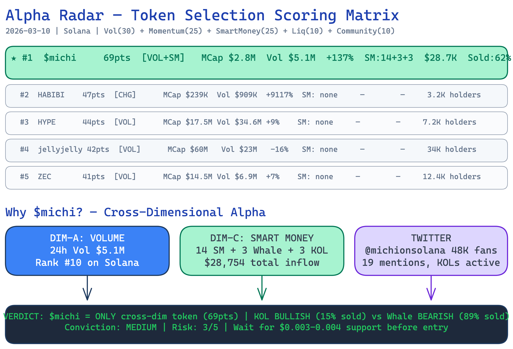

# OnChain Alpha Radar

<p align="center">
  <b>链上 Alpha 发现与研究流水线</b><br>
  Token 发现 · 持仓分析 · Smart Money 追踪 · 研报输出
</p>

<p align="center">
  <a href="../README.md">English</a>
</p>

---

一个 Claude Code Skill，串联 **4 个外部工具**，系统性地从链上原始信号中发现、分析并输出专业研报。

```
Token 发现 → 持仓分析 → Smart Money 追踪 → 研报输出
     ↓           ↓             ↓              ↓
  onchainos   onchainos     onchainos    deep-research
  + Twitter   + Twitter     + Twitter    + excalidraw
```

## 核心能力

| 阶段 | 输入 | 输出 |
|------|------|------|
| **Token 发现** | 扫描链上趋势/动量/聪明钱/Meme 新币 | 四维评分候选列表 |
| **持仓分析** | Token 地址 | Top 20 持仓、集中度、开发者声誉、钱包分类 |
| **聪明钱追踪** | Token 地址 | SM/巨鲸/KOL 信号、信念评估、钱包穿透 |
| **研报输出** | 以上所有数据 + Twitter | 完整 Markdown 研报 + Excalidraw 可视化图表 |

## 快速开始

### 1. 安装依赖

```bash
# 必需：OKX OnchainOS CLI
curl -sSL https://raw.githubusercontent.com/okx/onchainos-skills/main/install.sh | sh

# 可选：Twitter MCP（从 https://6551.io/mcp 获取 token）
git clone https://github.com/6551Team/opentwitter-mcp.git
claude mcp add twitter -e TWITTER_TOKEN=<你的token> -- uv --directory ./opentwitter-mcp run twitter-mcp

# 可选：Deep Research skill
git clone https://github.com/wshuyi/deep-research.git
cp -r deep-research/skills/deep-research ~/.claude/skills/

# 可选：Excalidraw Diagram skill
git clone https://github.com/coleam00/excalidraw-diagram-skill.git
cp -r excalidraw-diagram-skill ~/.claude/skills/excalidraw-diagram
```

### 2. 配置环境变量

```bash
# 必需：OKX API Keys（从 https://www.okx.com/account/my-api 创建）
export OKX_API_KEY="你的api-key"
export OKX_SECRET_KEY="你的secret-key"
export OKX_PASSPHRASE="你的passphrase"

# 国内用户需要代理（注意用小写！）
export all_proxy=http://127.0.0.1:7890
```

### 3. 安装此 Skill

```bash
git clone https://github.com/zhuyansen/onchain-alpha-radar.git
cp -r onchain-alpha-radar/.claude .claude
cp -r onchain-alpha-radar/.claude-plugin .claude-plugin
```

### 4. 开始使用

对 Claude Code 说：

```
给我扫描 Solana 上最热的 Token
做一份完整的链上研报
快速扫描 $michi
追踪 Solana 上的聪明钱
```

## 评分系统

四维交叉评分（满分 100）：

| 维度 | 权重 | 数据源 |
|------|------|--------|
| 成交量 | 30 分 | 24h 成交量排名 |
| 动量 | 25 分 | 4h 涨跌幅排名 |
| 聪明钱 | 25 分 | SM/巨鲸/KOL 钱包数 + 金额 + 卖出比例 |
| 流动性 | 10 分 | 流动性/市值比 |
| 社区 | 10 分 | 持有人数 |

**核心逻辑**：同时出现在 2 个以上维度的 Token 才是真 alpha，单维度高分可能是噪音。

## 示例输出



查看 [reports/](../reports/) 目录获取完整示例。

## 协议

MIT
